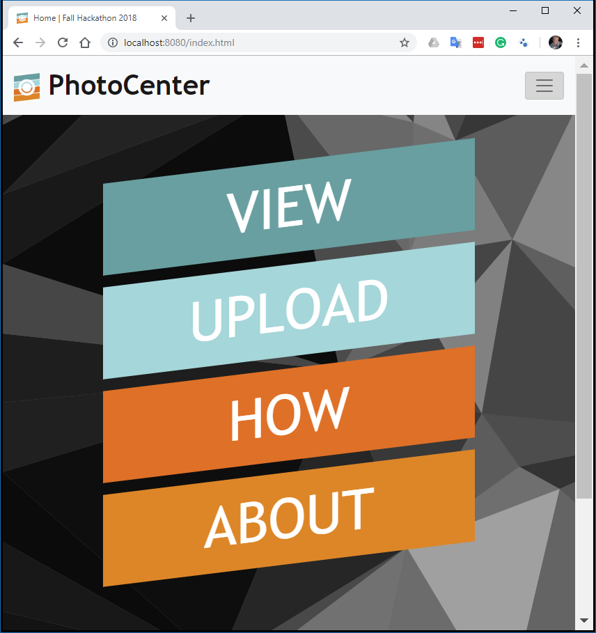
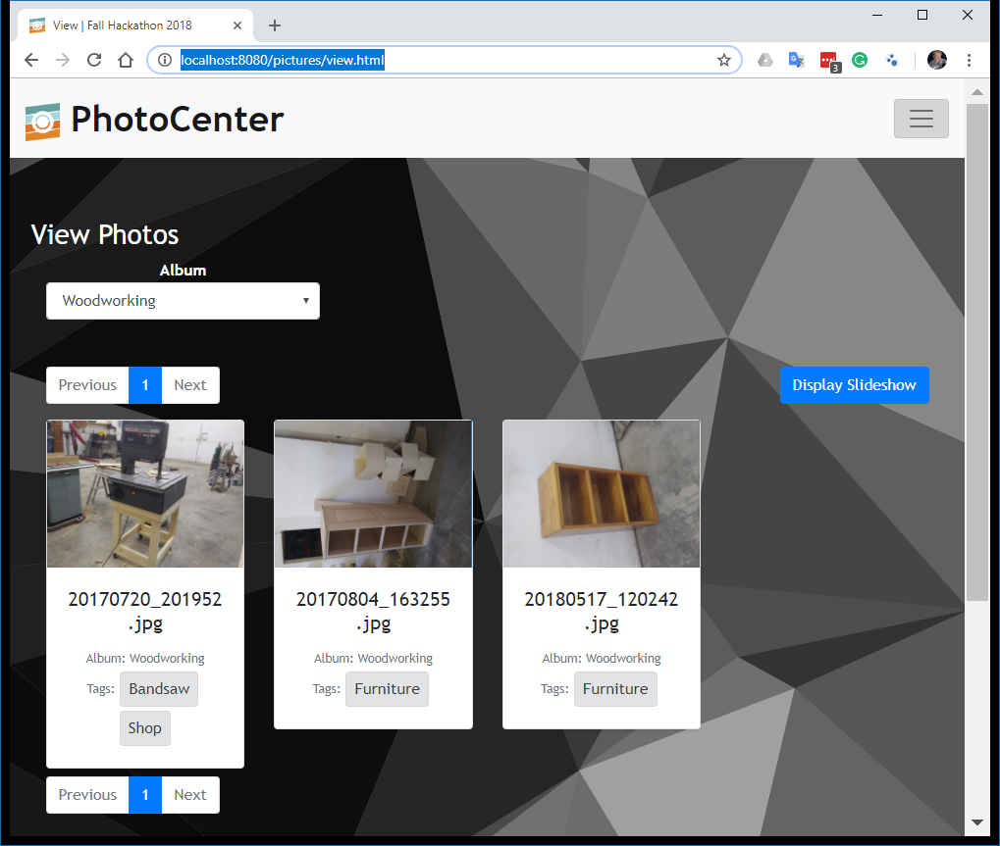
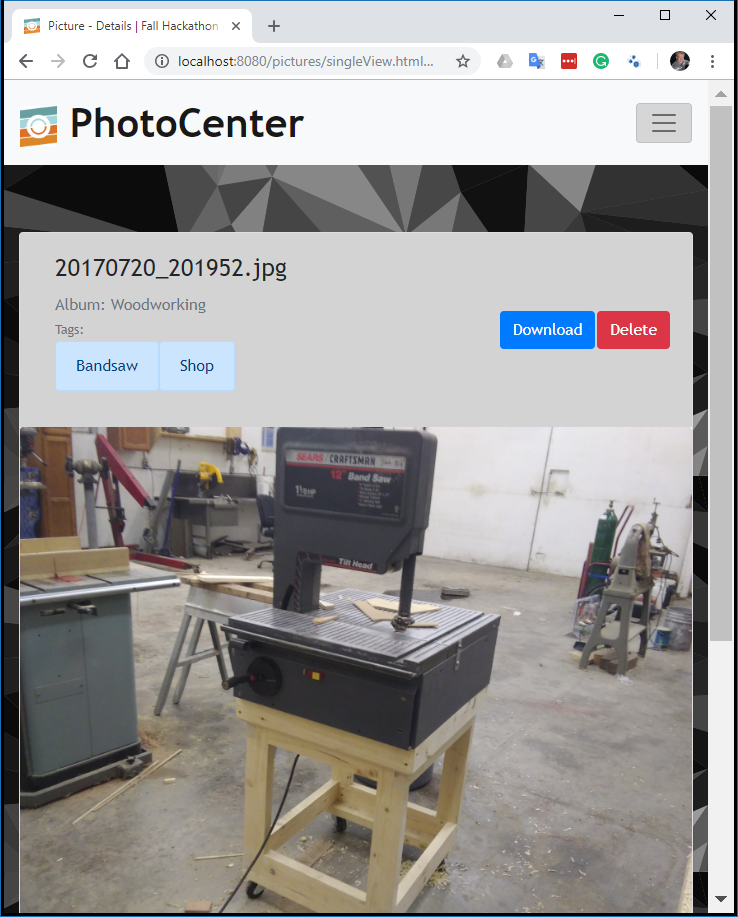

# HackISU Fall 2018 - Best in UI Design - PhotoCenter
#### Locally hosted Photo managment service with web interface and Android app
This app was built during a 36 hour long hackathon. It is fully functinoal and allows photo upload, storage, tagging, searching, and allows you to turn any device with a web browser into a picture frame. More information can be found about the project on the [DevPost](https://devpost.com/software/photocenter-he1ajs).
#### This Repository contains the server and web interface
For the Android App go to [this repository](https://github.com/maxdevos49/Fall2018HackathonAndriodApp)
## About
This server hosts a REST api for uploading and viewing stored photos. It also allows Socket connection for live notification of new photo uploads in order to views up to date. This server can be run on any device and network and will host the api as well as the web interface for the browser. Photos can be organized upon upload by an `album` identifier as well as an arbitrary number of `tags`.
<table>
  <tr>
    <td></td>
    <td></td>
    <td></td>
  <tr>
</table>

## Getting Started
The server currently requires an offsite MongoDB for the database using [mLab](https://mlab.com). Before continuing create an account and a MongoDB. The follow these instructions to start the server.
> 1. Open `config.js` and edit the line `"dbUrl": process.env.MONGODB_URI || "<YOUR MONGODB URL>",` by replacing `<YOUR MONGODB URL>` with your mLab MongoDB.
> 2. Run `npm install`
> 3. Run `npm build` followed by `npm run dev`
> 4. The server will now be hosted on `http://localhost:8080` as well as `<SERVER IP>:8080`
